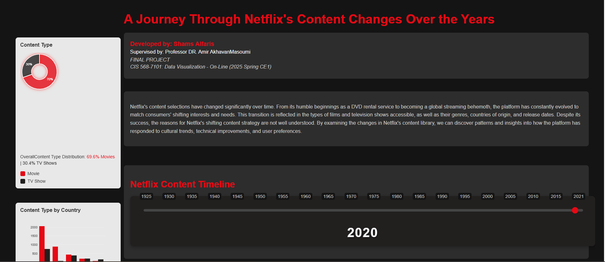
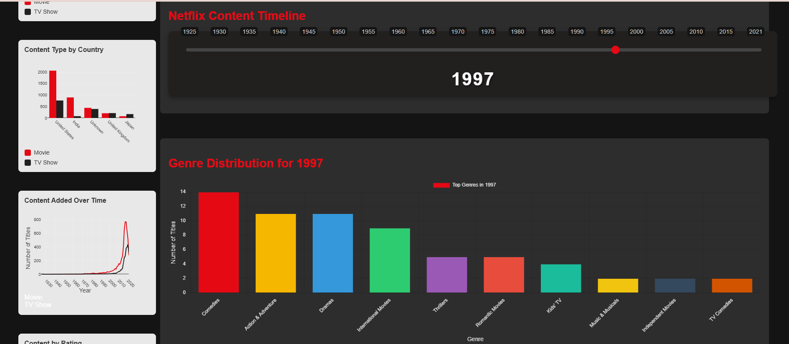
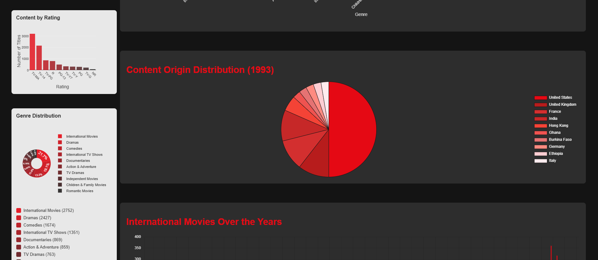
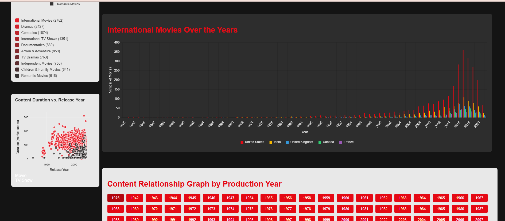
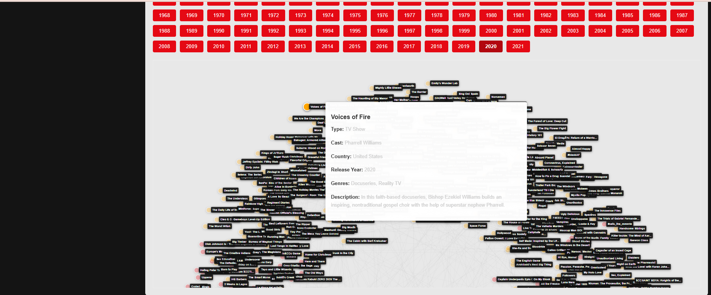
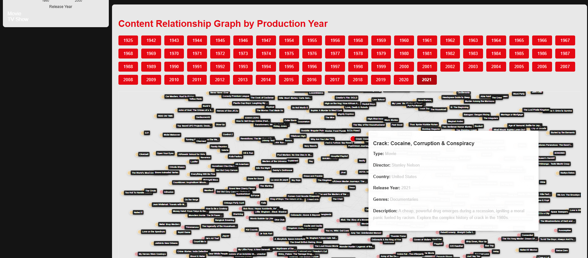

# A-Journey-Through-Netflix-s-Content-Changes-Over-the-Years
FINAL PROJECT CIS 568-7101: Data Visualization - On-Line (2025 Spring CE1)


# Netflix Content Evolution Visualization
# A Journey Through Netflix's Content Changes Over the Years

## Project Overview
This project presents an interactive visualization of Netflix's content library, showcasing the evolution of content types, genres, and origins over time. The visualization provides insights into Netflix's content strategy and growth patterns through various interactive charts and graphs.

## Developed by: Shams Alfaris
## Supervised by: Professor DR. Amir AkhavanMasoumi
## FINAL PROJECT
## CIS 568-7101: Data Visualization - On-Line (2025 Spring CE1)

## Project Requirements and Implementation

### 1. Running the Project
The project is a client-side web application that runs entirely in the browser. No server-side setup is required.

#### Prerequisites
- Modern web browser (Chrome, Firefox, or Edge recommended)
- Internet connection (for loading external libraries)

#### Steps to Run
1. Download the project zip file
2. Extract all contents to a local directory
3. Open `index9.html` in your web browser
4. The visualization will load automatically

### 2. Online Deployment
The project is deployed and accessible at:
[Insert your deployment URL here]

### 3. Project Structure and Files
The project zip file contains the following structure:
```
netflix-visualization/
├── data/
│   └── nextflix_titles.json          # Dataset containing Netflix content information
├── libes/
│   ├── d3.v7.min.js                  # D3.js library for visualizations
│   └── topojson@3                    # TopoJSON library for geographic data
├── styles.css                        # CSS styles for the visualization
├── main.js                           # Main JavaScript file
├── data-loader.js                    # Data loading and processing
├── index9.html                       # Main HTML file
└── README.md                         # Project documentation
```

### 4. Screenshots
The following screenshots demonstrate the key features of the visualization:

1. Content Type Distribution

*Pie chart showing Movies vs TV Shows distribution*

2. Genre Distribution

*Bar chart showing genre distribution over time*

3. Content Origin

*Visualization of content origins across different countries*

4. International Movies

*Trend analysis of international movie production*

5. Content Relationship

*Force-directed graph showing content relationships*

6. Timeline

*Interactive timeline slider for year-based filtering*

## How to Run
1. Clone the repository to your local machine
2. Ensure you have a modern web browser installed (Chrome, Firefox, or Edge recommended)
3. Open `index9.html` in your web browser
4. The visualization will load automatically with the Netflix content data

### Frontend Implementation
- HTML5, CSS3, and JavaScript
- D3.js for force-directed graph visualization
- Chart.js for bar and pie charts
- Plotly.js for additional visualizations
- Responsive design for different screen sizes


### Project Structure
```
netflix-visualization/
├── data/
│   └── nextflix_titles.json
├── libes/
│   ├── d3.v7.min.js
│   └── topojson@3
├── styles.css
├── main.js
├── data-loader.js
├── index9.html
└── README.md
```

## Visualization Components

### 1. Content Type Distribution
- **Visualization Type**: Pie Chart
- **Encoding**:
  - Color: Red (#E50914) for Movies, Dark Gray (#221f1f) for TV Shows
  - Size: Represents the proportion of content types
- **Interaction**: Static display showing the overall distribution of Movies vs TV Shows

### 2. Content Type by Country
- **Visualization Type**: Bar Chart
- **Encoding**:
  - X-axis: Country names
  - Y-axis: Number of titles
  - Color: Different colors for Movies and TV Shows
- **Interaction**: Shows distribution of content types across different countries

### 3. Content Added Over Time
- **Visualization Type**: Line Chart
- **Encoding**:
  - X-axis: Years
  - Y-axis: Number of titles added
  - Color: Different colors for Movies and TV Shows
- **Interaction**: Shows the trend of content addition over time

### 4. Content by Rating
- **Visualization Type**: Chart
- **Encoding**:
  - Distribution of content across different rating categories
- **Interaction**: Shows how content is distributed across different rating categories

### 5. Genre Distribution
- **Visualization Type**: Pie Chart
- **Encoding**:
  - Color: Different colors for each genre
  - Size: Represents the proportion of each genre
- **Interaction**: Shows the distribution of content across different genres

### 6. Content Duration vs. Release Year
- **Visualization Type**: Bubble Chart
- **Encoding**:
  - X-axis: Release Year
  - Y-axis: Duration
  - Size: Represents content quantity
  - Color: Different colors for Movies and TV Shows
- **Interaction**: Shows the relationship between content duration and release year

### 7. Netflix Content Timeline
- **Visualization Type**: Interactive Slider
- **Encoding**:
  - Range: 1925 to 2021
  - Color: Netflix Red (#E50914) for the thumb
- **Interaction**: 
  - Drag to select different years
  - Updates all visualizations to show data for the selected year

### 8. Genre Distribution Over the Years
- **Visualization Type**: Bar Chart
- **Encoding**:
  - X-axis: Years
  - Y-axis: Number of titles
  - Color: Different colors for each genre
- **Interaction**: Shows how genre distribution has changed over time

### 9. Content Origin Over the Years
- **Visualization Type**: Chart
- **Encoding**:
  - Distribution of content origins across different years
- **Interaction**: Shows how content origins have evolved over time

### 10. International Movies Over the Years
- **Visualization Type**: Chart
- **Encoding**:
  - X-axis: Years
  - Y-axis: Number of international movies
- **Interaction**: Shows the trend of international movie production over time

### 11. Content Relationship Graph
- **Visualization Type**: Force-directed Graph
- **Encoding**:
  - Nodes: Content items (Movies/TV Shows)
  - Links: Relationships between content
  - Color: Different colors for Movies and TV Shows
- **Interaction**: 
  - Draggable nodes
  - Hover for details
  - Year-based filtering

## Data Source
The visualization uses Netflix content data stored in `data/nextflix_titles.json`. The dataset includes information about:
- Content type (Movie/TV Show)
- Release year
- Genre
- Country of origin
- Duration
- Rating

## Technical Implementation
- Built using HTML, CSS, and JavaScript
- Uses D3.js for force-directed graph
- Chart.js for bar and pie charts
- Plotly.js for additional visualizations
- Data-loader.js for handling data loading and preprocessing
- Responsive design for different screen sizes

## Screenshots
- 
- 
- 
- 
- 
- 


## Notes
- The visualization requires an internet connection to load the required JavaScript libraries
- All data is loaded client-side from the JSON file
- The interface is optimized for modern web browsers 